# Power Grid Inventory - Again!  
PGIA is revamp of the classic PGI. A diablo style, grid based inventory system for Unity.

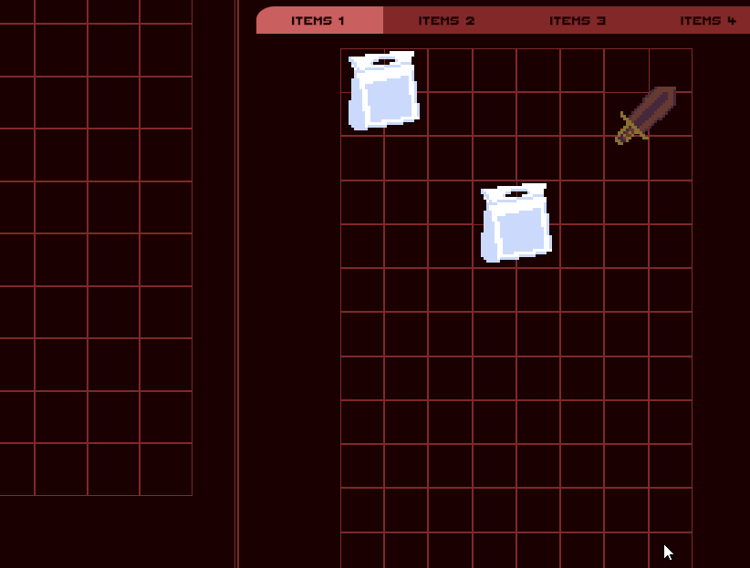  

# What's New  
A remake of PGI Classic, this new inventory system has been redesigned from scratch to take advantage of all the
features Unity brings to the table in 2022+. Such things include: newer C# language features, the use of scriptableobjects 
and both MonoBehaviour and non-MonoBehaviour based data models, and Unity's new GUI system, UIToolkit.

# Heads Up  
Take heed however, this is not going to be a commercial product like before and as such I will not be taking feature requests or providing official
support. It is designed with my own personal projects in mind and is subject to change as needed. But given that I know of a handful of people that
have been dying for PGI to see new light, I have decided to make it public for anyone to use, branch, and expand upon.

This project absolutely requires Odin. I do not have any desire to write custom editors when such a tool exists. If you do not have access to Odin
you can still theoretically use PGIA but it will require you to roll your own property drawers that match Odin's drawer attributes in order to gain
the full functionality. It also requires my own HashedString datatype which is linked below.

# Dependencies  
[Hashed String](https://github.com/Slugronaut/Toolbox-HashedString)  
[Odin](https://assetstore.unity.com/packages/tools/utilities/odin-inspector-and-serializer-89041)  

<br />
<br />

# A Simple Guide to Using PGIA 
The following is a quick-start guide for working with PGIA. It will not go into every detail but will instead provide the very basics to get an example up and running. Luckily once you understand the fundamentals of how to setup the rest shouldn't been too hard to explore and learn on your own. Under the hood it is a rather simple system.

<br />
<br />

## Environment setup  
The first thing we need to do is ensure that the project has all of the required dependecies. These include the new Input System, UIElements / UIToolkit, Odin, HashedString, and of course PGIA itself. This system was developed using Unity 2022 and is currently maintained for Unity 2022.3 so that version of Unity or later is recommended.
<br />

### IElements / UIToolkit  
PGIA is designed to work with Unity's new UIToolkit and does not support the old UGUI system anymore. You can ensure it is active by going to the Package Manager, selecting the *Built-in* packages from the dropdown and searching for UIElements. You should see something like the following screenshot if it is enabled.  

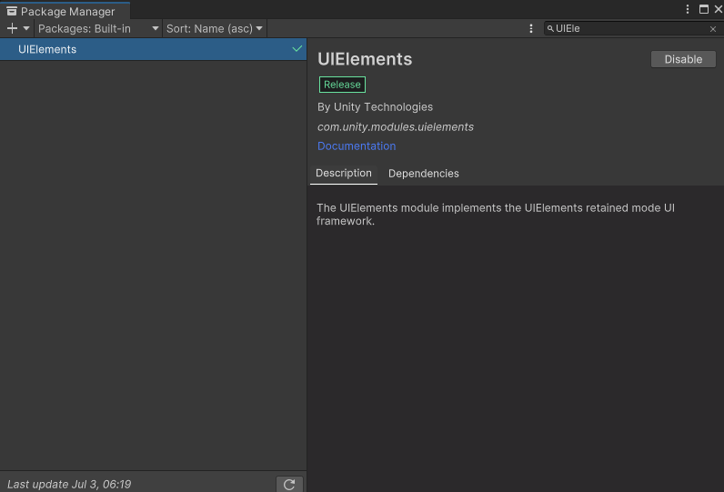  

### Input System  
PGIA also requires the new Input System from Unity in order to properly track mouse positions. Unfortunately, some parts of UIElements still rely on the old system as well but luckily Unity supports both system simultaneously. Once more, you can use the package manager to ensure you have installed the new Input System.  

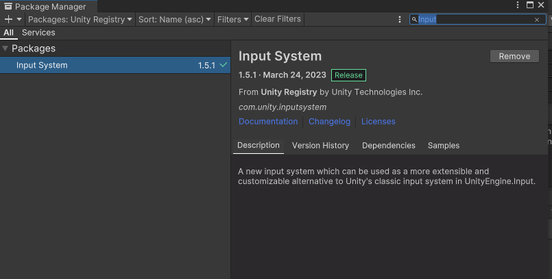  

After installing Unity will likely ask you if you want to enable the new system and then require a restart. You should opt to do this. You can also toggle this option in the *Project Settings->Player->OtherSettings* and set *Active Input Handling* to *Both*.

### Odin
Next up you will require Odin's Inspector tools. Anyone that is truly serious about developing with Unity should already have Odin Inspector and Serializer at this point but if for some reason you do not it will be required to continue. You can visit their website to learn more and even try out a free demo. [https://odininspector.com/download](https://odininspector.com/download)  

### Hashed String
And finally, you'll need a small library of my own. It simply allows you to declare a HashedString datatype that can be viewed in the inspector and serialized by Unity. Get it here: [HashedString](https://github.com/Slugronaut/Toolbox-HashedString)  

<br />
<br />

## Setting Up the Root UI
The first thing you'll want to do is define some assets that will be used for your system. Start up the UIBuilder and create a new asset. We'll call it UIPanel for now. Add a *VisualElement* to it. Provide a background color for it so that we can more easily see it. Next, add another *VisualElement* as a child of the first and again give it a background color that is different from the first. Again the background is just for visual clarity in the example and can be anything you want for a real project.

The child element should also be given a name. In this example let's call it 'GridContainer'. This will be used to contain your grid of cells that will be generated.  

Here is an example of how things might look.

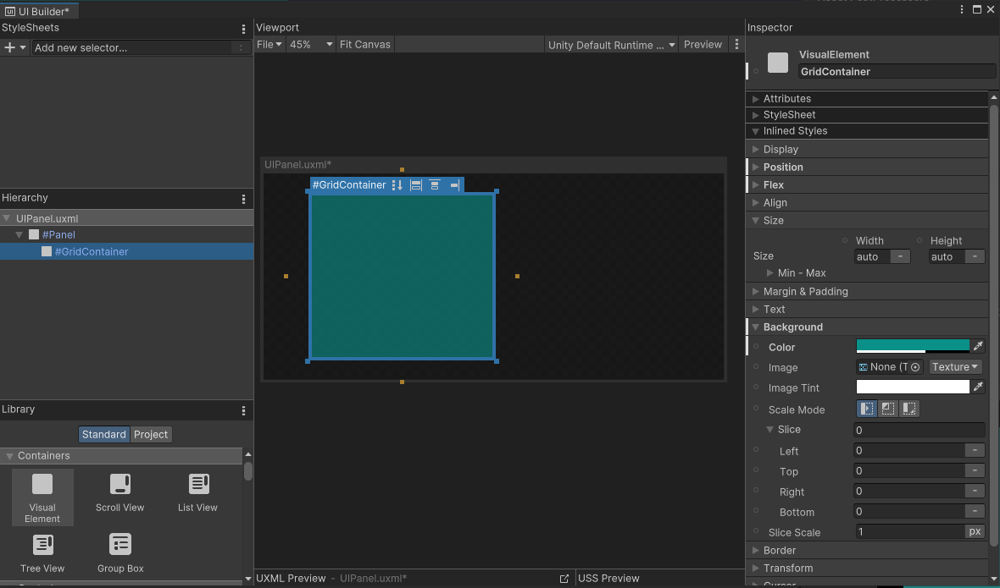  


After that, add create an empty GameObject in your scene and add a *UIDocument* component to it. Then supply a link to your UIPanel.  

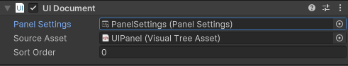  


## More UIElements  
So we'll need a couple more UI elements before we can get properly started. These will define both our cursor and the actual cells of the grid. Don't worry, I promise this will be easy. Let's start with the cursor.  

### The Cursor
The firs thing we want is a UI element to display our cursor when we are dragging items around. Open the UIBuilder again and add a single *VisualElement*. Name it 'Cursor'. This is important as this will be the tag that PGI uses to locate this particular object. Next, go to the Attributes and be sure to set *Picking Mode* to *Ignore*. This is done in code by PGIA but on some versions of Unity the API doesn't work so it must be forced manually in the editor. Save the file as something like 'Cursor.uxml' and that's it! All done!  

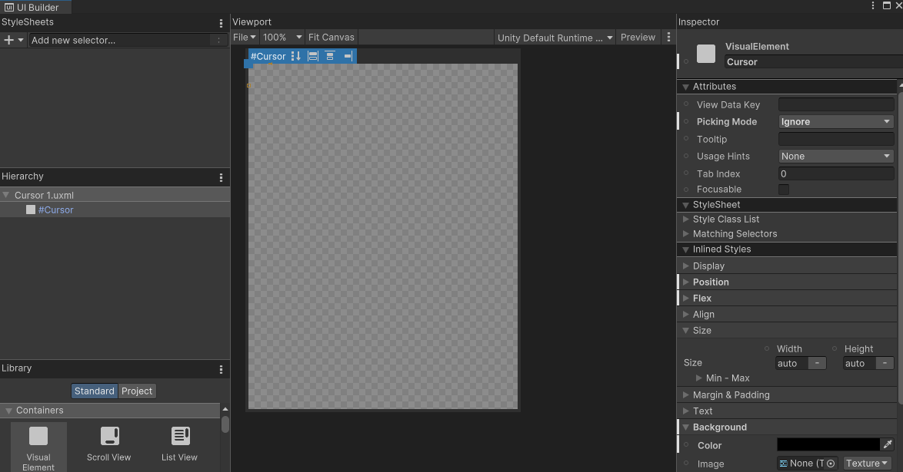  

See? I told you it would be easy. Keep in mind that this UI element will dynamically be resized as needed so you don't need to bother with any of that. You *can* add additional styling if you really want to but it's not necessary at all. When you aren't dragging anything it will remain invisible.  

### The Cursor Screen
There may be some cases where we want to have multiple different UIs on the screen but there could be a gap between them. For example a shop might have two windows on either side of the screen but nothing in between them. UIToolkit has no way of displaying or tracking movement across these so we'll need a kind of dummy object to handle this for us.

In the UIBuilder create a new tree. You can leave this one empty as PGIA will handle everything else internally. All you need to do is go to *Canvas Size* on the root and check the box for *Match Game View*.  

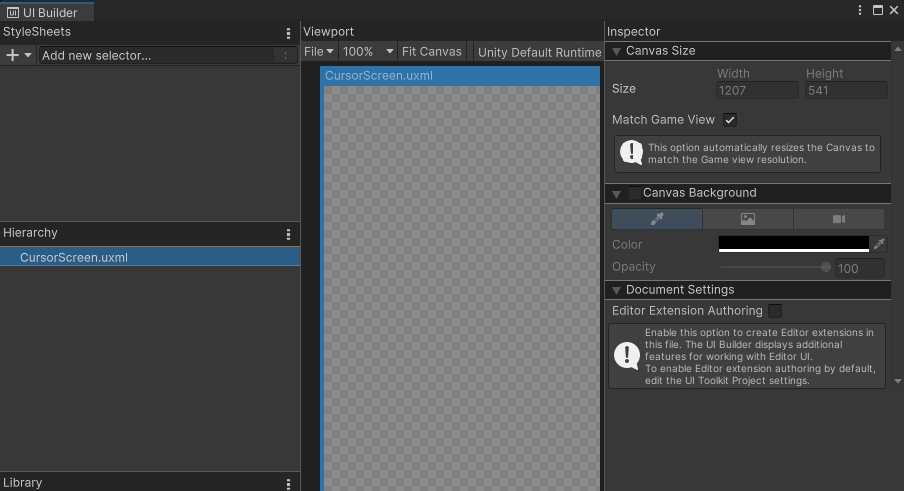  


### The Grid Cell  
The final element is the definition of the cell used by the grid. This is probably the most complicated. In short you need to create yet another element in UIBuilder, add the 'PGI.uss' stylesheet from the PGIA Package UI folder. Then create a *VisualElement* and name it 'Container' and apply the *.GridSlot* style class to it. Then add a text element as a child of 'Container' and name it 'StackQty'. The Container portion will display the icon for the grid cell and StackQty will of course be used to display a count when identical items are stacked in a single slot. 

You'll certainly want to be able to see the cell itself so after that you'll either want to manually override the border of the Container element to something like 2px with a color you like or alternatively you could define the variables used by the PGI.uss style sheet. They are as follows:  

```
border-left-color: var(--pgia-theme-cellborder-prime);  
border-right-color: var(--pgia-theme-cellborder-prime);  
border-top-color: var(--pgia-theme-cellborder-prime);  
border-bottom-color: var(--pgia-theme-cellborder-prime);
```
  
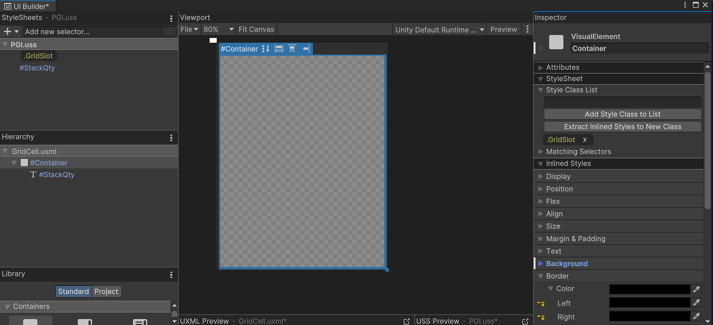  


As with all of the other elements you can choose to add any other number of visual flourishes you desire including the placement of the StackQty element. This is all rather long-winded though so if you prefer a shortcut you can simply copy the 'GridCell.uxml' file found in PGIA's UI folder and start there, You'll still need to either define the border variables or override them in the UIBuilder yourself.

<br />
<br />

## ScriptableObject Assets  
There are a number of assets that are used by PGIA to share data between instances of objects. Let's create them now. We'll start with the DragCursor asset.

### Drag Cursor Asset  
First let's create a Drag Cursor Asset. This will contain information that is referenced by PGIA when displaying the the icon for an item when it is being moved around.  

In your project window create a folder to hold all of your UI assets and then open the context menu and navigate to *Create->PGIA->Drag Cursor*. This will create a DragCursor scriptableobject asset in that folder.  

Click on the new file and you'll see three entries. The first one is called *Cursor Asset*. Locate the 'Cursor.uxml' file you created earlier and drag it into that spot. Next you'll see *Screen Asset*. Do the same with the 'CursorScreen.uxml' file you created earlier. This will allow any view using this DragCursor asset to know how to actually display it.  

The final entry is called *Panel Settings*. If you look at the UIDocument component in your scene that you created earlier you'll see a reference to a *PanelSettings* asset. Locate that file and then make a duplicate of it and name it 'CursorSettings'. Select that asset and then change *ScaleMode* to *Scale With Screen Size*. You'll also likely want to set a reference resolution and slide the *Match* bar all the way to *Height*. Finally, link this asset to the *Panel Settings* of your DragCusror. Setting the scaling is important here because it ensures that the mouse clicks and drag icon are registered in the correct location of the screen regardless of your screen resolution or ratio.  

When you are done it should look like the below images.  

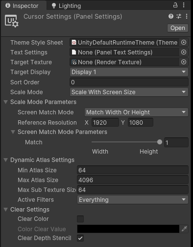  

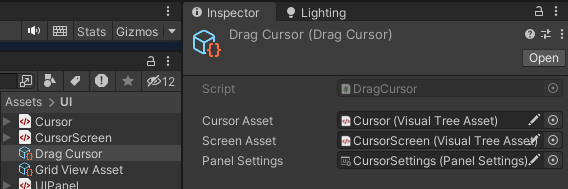  

### Grid View Asset  
Next we need an asset that defines some of the visual aspects of our grid views. Again navigate to your UI folder and use the conext menu to select *Create->PGIA->Grid View Asset*. For now you can leave this file with its default values. Which is what we will work on next.  

<br />
<br />

## MVC
PGIA uses a very simple form of MVC to manage data and display it. A Model simply stores the state of an inventory. A view can be given a link to a model and it will display that model's state as a UI grid. The model can even be dynamically swapped to allow the reuse of a single view.  

For the most part the view handles updating of the model when the user interacts with its UI. And if the model is updated manually through code it will inform the view and cause it to reflect any changes. Which means you can mostly just write code to interact with the model and it will just work.  


>NOTE:  
PGIA provides a GridModel and IGridModel interface that allows for creating    inventories entirely through code. However there is a convience MonoBehaviour called GridModelBehaviour that simply wraps a GridModel to allow for easier integration with Unity's inspector. The GridViewBehaviour currently is not a wrapper but instead the actual view object. This may change in the future.


### The Model
Create a new GameObject in the scene and name it 'Inventory'. Attach a *GridModelBehaviour* to it. This will represent the data of our inventory. Give it a size of 10x10 cells. The other options can be left alone for now. Congrats! You now have an inventory!

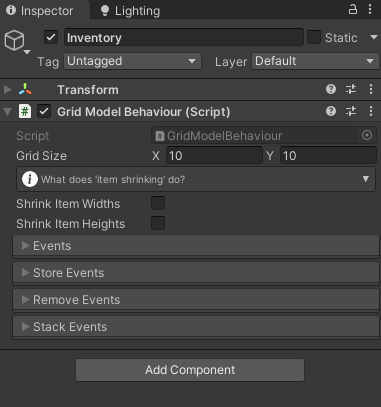 


### The View
Locate the GameObject that has your *UIDocument* component and add a *GridViewBehaviour*. It's not necessary that it be attached to the same object as the UIDocument but I find it usually helps with organizing things since they are very closely related.  

Now it's time to glue everything together! First link the *Model* to the *GridModelComponent* you just created in the previous step. Next link the *View* to the *UIDocument* component in this same GameObject. Be sure the *Grid Container Id* matches the name you gave to the container element in your UI. It should be *GridContainer* if you followed along exactly.  

> This value can use dot separators to find child elements. By default it will search out the first valid entry it can find but if you have a complicated structure you can specify a hirarchy.  

>For example you could type 'Panel.GridContainer' if you also named the parent element 'Panel'. This allows you to have multiple containers with the same name that can be linked seperately based on their hierarchy in the UI tree. You can then have multiple Views all pointing to their associated container without getting confused.

Next up, link the *Cursor Asset* to the Drag Cursor asset we created earlier. Then link the *Cell UI Asset* entry to the 'GridCell.uxml' we created. Finally, link the *Shared Grid Asset* to the Grid View Asset and we are finally done! If you followed along closely it should look similar to this:  

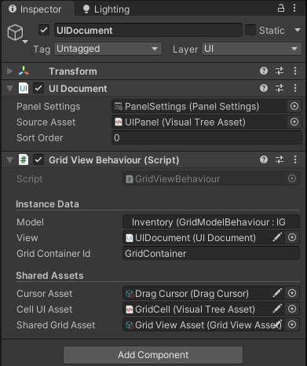 


And with that, you are all done! You should now have a working inventory and view setup and ready to go! Try entering play mode and you should see a grid populating your UI.

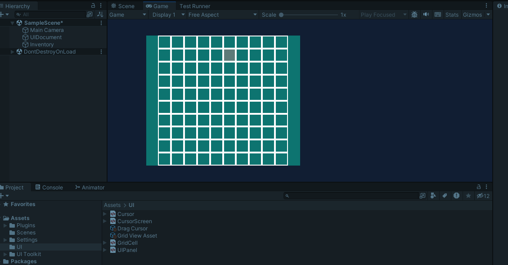 

But it looks so empty. Let's make some items and learn how to fill it.

<br />
<br />

## Items and Inventory Manipulation

Next we'll learn how to define an item for use in the grid system and finally learn how to add them to and remove them from an inventory using code.  

### Inventory Item

Unlike PGI, PGIA does not require the use of GameObjects or MonoBehaviours to handle instances of items. And instead of storing the properties of the item per instance it now uses a ScriptableObject asset to share this information between all instances of the same item. This is great news as it means it can much more efficiently handle inventories than before!  

However, once again for the sake of convienience we'll use a MonoBehaviour that is a wrapper for the raw data. Even still, the shared properties alone are a vast improvement over the old system and can potentially save loads of RAM in the case of large inventories being present.  

Navigate to your UI folder once more and open the context menu. Select *Create->PGIA->Inventory Item* to create an item asset. This asset represents the fixed properties that never change and are shared between instances of the same item.  

Currently most of the features in here are not used directly by PGIA and are simply there for my own personal use. Perhaps in the futrue *Id* and *Category* might get used for some kind of search or filtering feature. For now the only things that matter are *Icon* and *Size*. Select an appropriate icon for your item and then give it a size of at least 1x1 and no more than the size of your inventory (which in this example is 10x10).  

 

Now return to your scene and add a new GameObject and call it 'Item'. Add a *GridItemModelBehaviour* script to it. There is a field named *Shared* that you should link to the item asset you just created. Congrats! You now have an item to store in your inventory!

> Again, I just want to stress that you don't strictly need a GameObject and MonoBehaviour here. They are simply there for convienience and impliment the IGridItemModel interface and act as a wrapper for GridItemModel.  

### Add an Item to an Inventory
Adding and removing items is a very simple process. All you need to do is get a reference to your IGridModel object and call the *StoreItem()* and *RemoveItem()* methods. There are several helper methods that can make things easier such as *FindOpenSpace()* to... well... find a place to store an item.  

PGIA comes with a small utility MonoBehaviour for testing that can demonstrate this functionality. Select your Model from the scene and add a *StoreItemTester* behaviour to it. Link the *Item* to the *GridItemBehaviour* script from your 'Item' GameObject in the scene. Then link the the *Inventory* to the *GridModelBehaviour* script of your 'Inventory' GameObject.  

Start up your scene and the select a slot location for *X* and *Y* in the inspector window. Items are stored using their top-left corner as the coordinate so anything greater than 0x0 and less than the width and height of the inventory minus the width and height of the item should work here. Finally, press the 'Test Store' button in the inspector and it should store your item in the inventory.  

 

You can also test removing items by select a coordinate that overlaps with the item and pressing 'Test Remove'. I'll leave it as an exercise for you to have a look at the code for the script and learn how it works.  

### Drag Icon Size  

One thing to note is that your drag icon might not match the size of the icon in the inventory. This is probably due to the panel settings for your UIDocument. If things look weird try adjusting the panel settings to match those of your cursor's panel settings. I usually go with *Scale with Screen Size* for both as it makes things much easier but experienced UIToolkit users should be able to figure out what best meets their own needs.


### Multiple Inventories  

For the most part PGIA just works when it comes to multiple inventories. To create another inventory just create another UIDocument, model, and view and link everything up like before. Items can be seamlessly moved between the two inventories with no additional work from you. 

### Filtering  

If for some reason you want to stop an item from being moved to another inventory then you can always use the *IGridModel.OnWillStoreItem* event. Simply add a listener to handle this event and when invoked, just perform whatever checks you need. If you decide an item should not be allowed to store in a model invoke the *Cancel()* method of the *OperationCancelAction* that was passed to the event handler.  


## Conclusion  

And with that you now have a functioning inventory! There are several other features I haven't gone into such as events for items, models, and views but they should hopefully be pretty self explanitory.  

Enjoy!  


